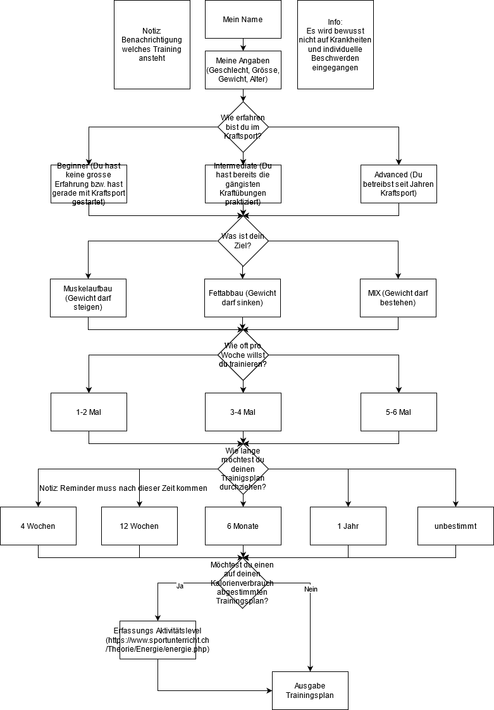

<!-- Einleitung-->
<h2 align="center">Trainingsplan inkl. Logbuch</h2>
  

Generierung eines Gym-Trainingsplans nach den Vorstellungen des User   
inkl. Berechnung des Fortschritts durch Logbuch-Einträge.

<!-- Inhaltsverzeichnis -->

  
<h2 style="display: inline-block">Inhaltsverzeichnis</h2>

  <ol>
    <li>
      <a href="#ausgangslage">Ausgangslage</a>
    </li>
    <li>
      <a href="#projektidee">Projektidee</a>
    </li>
    <li><a href="#anleitung">Anleitung</a></li>
    <li><a href="#workflow">Workflow</a></li>
          <ul>
        <li><a href="#dateneingabe">Dateneingabe</a></li>
        <li><a href="#datenverarbeitung">Datenverarbeitung</a></li>
         <li><a href="#datenausgabe">Datenausgabe</a></li>
      </ul>
    <li><a href="#erweiterbarkeit">Erweiterbarkeit</a></li>
    <li><a href="#kontakt">Kontakt</a></li>
  </ol>

<!-- Ausgangslage -->
## Ausgangslage
In der Schweiz waren seit dem ersten Lockdown im März 2020 die Fitnessstudios mehrere Monate geschlossen. Nur die wenigsten Personen haben die finanziellen Mittel und Ressourcen, um ein Home-Gym einzurichten. Die meisten Fitnessinteressierten versuchen durch Bodyweight-Übungen im Flow zu bleiben, doch mit der Zeit nimmt die Motivation ab und man verliert das Ziel aus den Augen.  Mit Aussicht auf baldige Lockerungen und dem voranschreiten der Impfungen, möchte ich mit einem individuellen, auf den User abgestimmten Trainingsplan Anreiz schaffen, um sich neue Ziele zu setzen und einer geregelten Fitnessroutine nachzukommen. 

<!-- Projektidee -->
## Projektidee

Der User möchte nach dem Corona-Lockdown wieder in einem Fitnessstudio trainineren. Dafür benutzt er dieses Programm. Hierfür werdem dem User diverse Fragen gestellt, welches einen auf den User zugeschnittenen Trainingsplan generiert. Zusätzlich kann der User seinen Kalorienverbrauch ins Training miteinbringen. Der User weiss daher, wie er durch die im Training verbrauchten Kalorien wiederum in seiner Ernährung anzupassen hat.  Der generierte Trainingsplan enthält Eingabefelder, um je Übung die Satz- und Wiederhohlungsanzahl zu notieren. Der Fortschritt wird von Training zu Training berechnet und gibt die Steigerung bzw. Minderung in Prozent aus.

<!-- Anleitung -->
## Anleitung

Beschreibung einer Anleitung für die Nutzung des Trainingsplans

<!-- Workflow-->
## Workflow
### Dateneingabe

Benötigte Angaben des Users:
- Geschlecht, Alter, Gewicht, Grösse  => führt zu unterschiedlichen Trainingsplan ausführen zwischen m/w sowie Logbucheintrag Gewicht für das Wunschziel
- Trainingserfahrung (Beginner, Intermediate, Advanced)  => führt je nachdem zu einem Ganzkörper, 2er-, 3er-, 4er-, 5er- oder 6er-Split
- Trainingsfrequenz (wieviele Trainingseinheiten möchte der User pro Woche absolvieren)  => führt je nachdem zu einem Ganzkörper, 2er-, 3er-, 4er-, 5er- oder 6er-Split
- Ziel (Muskelaufbau, Fettabbau, Mix)  => führt je nachdem zu einem angepasstem Trainingsplan z.B. mit Cardio Elementen
- Traininsplandauer  => führt zu einem Abschluss (Ziel vor Augen, Motivation) z.B. 12 Wochen/1 Jahr (-> danach Reminder um neuen TP zu erstellen)
- Aktivitätslevel (für die Berechnung des Kalorienverbrauchs bzw. Grundumsatz)  => führt zu einer angepassten Tageskalorien-Empfehlung (Abhängigkeit zu Trainingsplan & Ziel)

### Datenverarbeitung
Speicherung
### Datenausgabe

<!-- Erweiterbarkeit-->
## Erweiterbarkeit
- Benachrichtigung des Users, welches Training heute ansteht.
- Logbucheinträge, welche mit Fotos ergänzt werden können.
- Logucheinträge, welche mit Gewicht und Ernährung ergänzt werden können.
- Rücksichtnahme beim Erstellen des Trainingsplans auf Krankheiten/Verletzungen. 

<!-- Kontakt-->
## Kontakt
Pascal Ammeter  
dbm19tz

