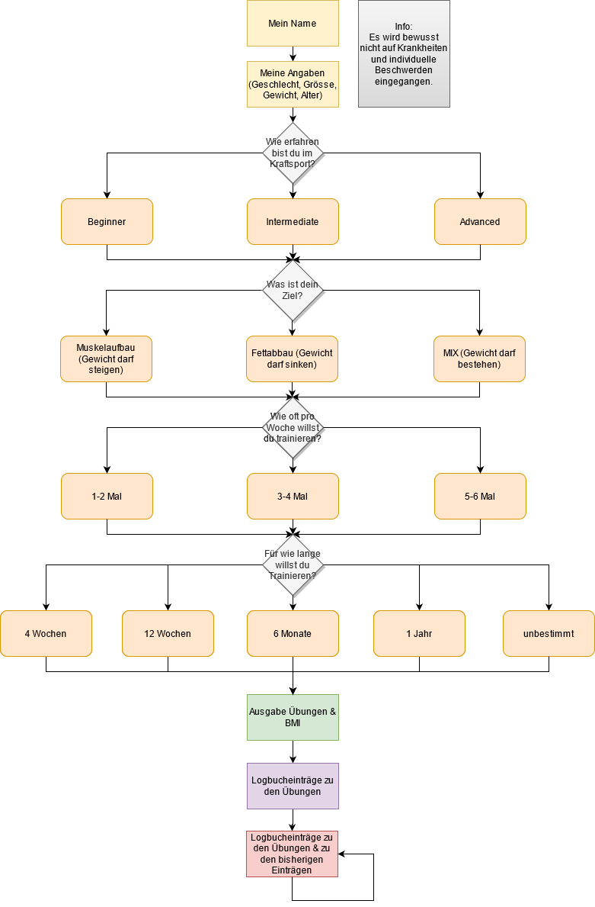

<!-- Einleitung-->
<h2 align="center">Trainingsplan-Generator</h2>
  

Ausgabe von Gym-Trainingsübungen aufgrund der Angaben des Users inkl. 
Berechnung des Body Mass Index und der Möglichkeit, seine Fortschritte im Logbuch einzugeben. 

<!-- Inhaltsverzeichnis -->

  
<h2 style="display: inline-block">Inhaltsverzeichnis</h2>

  <ol>
    <li>
      <a href="#ausgangslage">Ausgangslage</a>
    </li>
    <li>
      <a href="#projektidee">Projektidee</a>
    </li>
    <li><a href="#anleitung">Anleitung</a></li>
    <li><a href="#workflow">Workflow</a></li>
          <ul>
        <li><a href="#dateneingabe">Dateneingabe</a></li>
        <li><a href="#datenverarbeitung, speicherung, datenausgabe">Datenverarbeitung, Speicherung und Datenausgabe</a></li>
         <li><a href="#bugs">Bugs</a></li>
      </ul>
    <li><a href="#erweiterbarkeit">Erweiterbarkeit</a></li>
    <li><a href="#kontakt">Kontakt</a></li>
  </ol>

<!-- Ausgangslage -->
## Ausgangslage
In der Schweiz waren seit dem ersten Lockdown im März 2020 die Fitnessstudios mehrere Monate geschlossen. 
Nur die wenigsten Personen haben die finanziellen Mittel und Ressourcen, um ein Home-Gym einzurichten. 
Die meisten Fitnessinteressierten versuchen durch Bodyweight-Übungen im Flow zu bleiben, doch mit der Zeit 
nimmt die Motivation ab und man verliert das Ziel aus den Augen.  Mit Aussicht auf baldige Lockerungen 
und dem voranschreiten der Impfungen, möchte ich mit einer individuellen Übungsausgabe, auf den User abgestimmten 
Trainingsplan Anreiz schaffen, um sich neue Ziele zu setzen und einer geregelten Fitnessroutine nachzukommen. 

<!-- Projektidee -->
## Projektidee

Der User möchte nach dem Corona-Lockdown wieder in einem Fitnessstudio trainineren. 
Dafür benutzt er dieses Programm. Hierfür werdem dem User diverse Fragen gestellt, 
welches einen auf den User zugeschnittenen Trainingsplan (Übungen) generiert.  
Zusätzlich wird der BMI vom User berechnet und mit dem altersbezogenen idealen BMI-Wert verglichen
und visuell dargestellt. Der generierte Trainingsplan enthält Eingabefelder, 
um je Übung die Satz- und Wiederhohlungsanzahl zu notieren.
  

<!-- Anleitung -->
## Anleitung

Damit die Webapplikation vollumfänglich genutzt werden kann, müssen folgende Module installiert sein:
- Python 3.9
- Flask
- Jinja2
- Plotly

Start:  
Durch das Ausführen der Datei "main.py" startet die Webapplikation.
Danach kann durch klicken auf den Button "Trainingsplan erstellen" begonnen werden. 

<!-- Workflow-->
## Workflow
### Dateneingabe

Benötigte Angaben des Users:
- Geschlecht, Alter, Gewicht, Grösse  => führt zu unterschiedlichen Übungsausgaben zwischen m/w sowie BMI-Berechnung
- Trainingserfahrung (Beginner, Intermediate, Advanced)  => führt je nachdem zu einem Ganzkörper, Oberkörper/Unterkörper (OK/UK) oder 3er-Split
- Trainingsfrequenz (wieviele Trainingseinheiten möchte der User pro Woche absolvieren)  => führt je nachdem zu einem Ganzkörper, Oberkörper/Unterkörper (OK/UK) oder 3er-Split
- Ziel (Muskelaufbau, Fettabbau, Mix)  => führt je nachdem zu einem angepasstem Trainingsplan z.B. mit Cardio Elementen
- Traininsplandauer  => führt zu einem Abschluss (Ziel vor Augen, Motivation) z.B. 12 Wochen/1 Jahr

Die benötigten Angaben werden beim ersten Formular erhoben und dient als Grundlage für den weiteren Verlauf. 

### Datenverarbeitung, Speicherung und Datenausgabe

Datenverarbeitung und Speicherung:  
Die erhaltenen Daten über den User werden in der Datei "data.json" gespeichert. Bereits gegeben ist ein Übungspool
bestehend aus 70 unterschiedlichen Übungen in der Datei "exercises.json". Diese Daten durchlaufen mehrere 
Condition-Abfragen (if/else), wonach zutreffende Übungen als Dictionaries wiederum in der Datei "exercises_user.json" 
abgespeichert werden. In einem nächsten Schritt kann der User zu den Übungen Logbucheinträge (1. Satz, Gewicht, 2. Satz, Gewicht, 3. Satz, Gewicht) hinzufügen. Die Logbucheinträge werden nun zusammen mit den Übungen in der Datei
"exercises_logbuch.json" gspeichert. 

Datenausgabe:  
Die auf den User zugeschnittenen Übungen werden mitsamt Berechnung des BMIs ausgelesen und in einer Tabelle mittels
Jinja2 dargestellt (iterieren durch for-loop). Die Übungen sowie dazu gespeicherten Logbucheinträge werden zuletzt wieder
ausgegeben, sodass man wiederum neben den alten Logbuchwerten neue Logbucheinträge hinzufügen kann. 

### Bugs

KeyError: 'splitb':  
Die Webapplikation läuft leider nicht ganz reibungslos. Es kann sein, dass wenn gewisse Conditions zutreffen, anstatt 
den Übungen den KeyError: 'splitb' erscheint. Alle anderen Abfragen mit splita und splitc funktionieren einwandfrei,
obwohl die Conditions zum splitb identisch aufgebaut sind. Folgende Abfragen ergeben diesen Fehler:
- beginner, muskelaufbau & mix, mittel, zeitplan alle
- beginner, fettabbau, mittel, zeitplan alle
- intermediate, muskelaufbau & mix, wenig, zeitplan langfristig
- intermediate, fettabbau, wenig & mittel, zeitplan alle
- advanced, muskelaufbau & mix, wenig, zeitplan kurzfristig
- advanced, muskelaufbau & mix, wenig, zeitplan langfristig
- advanced, fettabbau, wenig, zeitplan alle

Logbucheinträge:  
Nachdem der User die Übungen erhält, wird er auf das Logbuch weitergeleitet. Dort hat er die Möglichkeit,
zu jeder Übung Einträge (Sätze, Gewicht) zu machen. Möchte man nun die Einträge "Speichern und weitere 
Logbucheinträge hinzufügen" löst es das kommende Formular nicht mit der POST-Methode (if) aus. Anstelle (else) wird das
Template "logbuch" gerendert. 
Auch wenn das Formular ausgelöst würde, speichert es die gemachten Einträge nicht ins dafür vorgesehene JSON
"exercises_logbuch.json" ab. Mein Versuch ist es, dass die generierten Übungen sowie die neuen Einträge zu den Übungen 
zusammen im neuen JSON "exercises_logbuch.json" gespeichert werden. Beim nächsten Mal würde es mir die zuletzt
gespeicherten Einträge im Formular anzeigen (logbucheintrag.html). Mit jedem Mal wo ich Logbucheinträge speichere, würde
es die vorherigen Einträge überschreiben. Ich gehe davon aus, dass ich keine Einträge zu den Übungen abspeichern kann,
da die Übungen mit der Jinja-Logik ausgegeben werden. Eventuell können dadurch keine neuen Einträge zusammen abgespeichert
werden.

<!-- Erweiterbarkeit-->
## Erweiterbarkeit
- Übungsausgabe direkt nach Split eingeteilt.
- Benachrichtigung des Users, welches Training heute ansteht.
- Logbucheinträge, welche mit Fotos ergänzt werden können.
- Logucheinträge, welche mit Gewicht und Ernährung ergänzt werden können.
- Rücksichtnahme beim Erstellen des Trainingsplans auf Krankheiten/Verletzungen. 

<!-- Kontakt-->
## Kontakt
Pascal Ammeter  
dbm19tz

